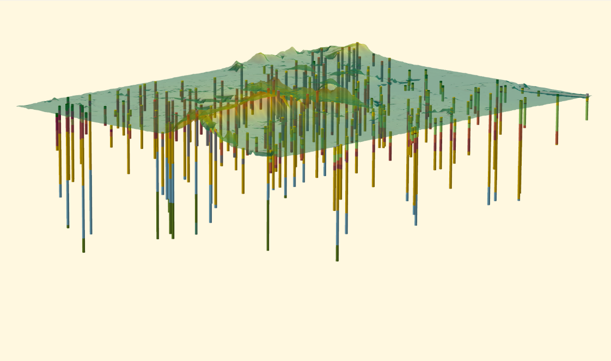
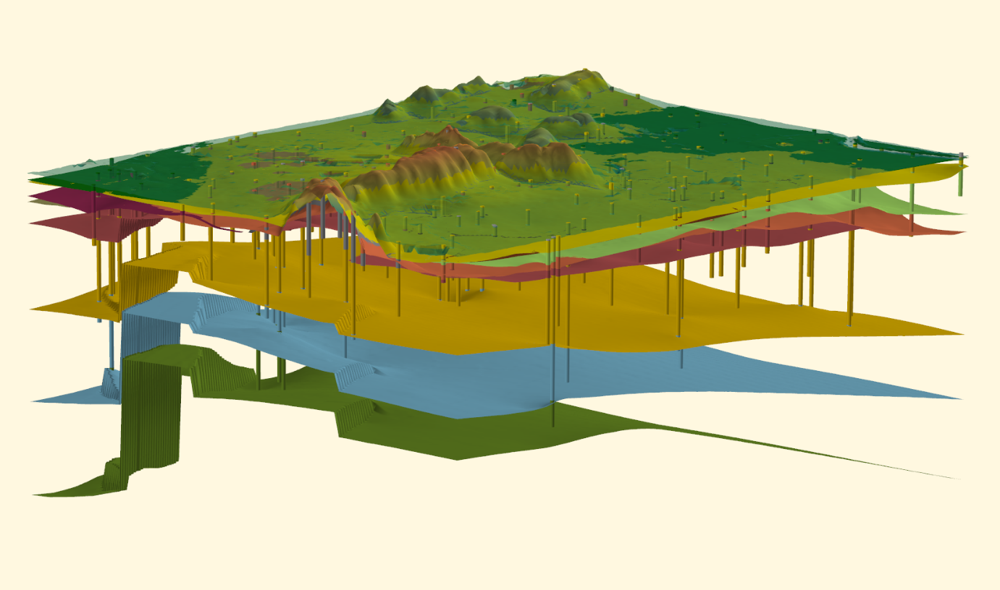

Ondergrondmodel DGM
===================

Beschrijving
------------

DGM (Digitaal Geologisch Model) is een registratieobject in het domein
*modellen*. Het gaat in dit domein om schematische weergaven van de
werkelijkheid in twee of drie dimensies. Deze schematische weergaven geven een
schatting of voorspelling van de opbouw en eigenschappen van de bodem of
ondergrond. Modellen zijn sterk afhankelijk van de hoeveelheid en kwaliteit van
de beschikbare ondergrondgegevens zoals boormonsterbeschrijvingen. De kwaliteit
van de modellen zal daarom toenemen naarmate er meer ondergrondgegevens in de
BRO beschikbaar komen.

DGM is een driedimensionaal geologisch model van de laagopbouw van de matig
diepe ondergrond van Nederland tot een gemiddelde diepte van ongeveer 500 m
onder NAP, met een maximum diepte van 1200 m onder NAP. De basisbouwstenen van
DGM zijn lithostratigrafische c.q. geologische eenheden. Deze termen worden
hieronder toegelicht:

-   **Lithostratigrafie** betekent het rangschikken van gesteentelagen in
    eenheden zoals formaties en laagpakketten op basis van lithologische
    kenmerken (waaruit bestaat het materiaal?), verbreiding (waar komt de
    eenheid voor?) en positie (wat is de ligging ten opzichte van andere
    eenheden?). Lithostratigrafische eenheden worden formeel gedefinieerd in de
    Stratigrafische Nomenclator van de Ondiepe Ondergrond van Nederland.

-   In DGM wordt de term **geologische eenheid** gebruikt in plaats van
    lithostratigrafische eenheid omdat niet elke eenheid in het model één-op-één
    overeenkomt met een lithostratigrafische eenheid volgens de Nomenclator. Het
    kan namelijk voor de modellering nodig zijn om twee of meer
    lithostratigrafische eenheden samen te nemen tot één geologische eenheid. De
    tegenovergestelde situatie, waar een lithostratigrafische eenheid wordt
    gesplitst in een of meerdere geologische eenheden komt ook voor.

DGM bestaat uit de volgende in de BRO opgenomen producten die ontstaan uit een
gestandaardiseerd werkproces:

-   De interpretaties van de geselecteerde boormonsterbeschrijvingen in
    **geologische eenheden**. Elke boormonsterbeschrijving is onderverdeeld in
    dieptetrajecten behorende bij een geologische eenheid.

-   **Breuken**. Per breuksegment is aangegeven in welke basis van een
    geologische eenheid dit breuksegment nog invloed heeft.

-   Een **lagenmodel** waarbij de ondergrond is weergegeven als een stapeling
    van geologische eenheden die begrensd zijn door een top- en een basisvlak.
    Beide vlakken zijn weergegeven als een **raster** met cellen van 100 x 100
    meter, waarbij elke **rastercel** de hoogteligging van top en basis in meter
    ten opzichte van NAP geeft en daarvan afgeleid de dikte in meters. Zowel
    voor de top, dikte als basis zijn rasters beschikbaar die de
    modelonzekerheid van het lagenmodel representeren. Ook is er een kans op
    voorkomen per geologische eenheid beschikbaar.

De onderlinge samenhang van de in de BRO opgenomen geïnterpreteerde
boormonsterbeschrijvingen en het lagenmodel is geïllustreerd in Figuur 3.1 –
3.2.

*Figuur 3.1: 3D weergave van boormonsterbeschrijvingen waarbij de kleuren
verschillende geologische eenheden weergeven.*

*Figuur 3.2: 3D weergave van een lagenmodel gebaseerd op de geïnterpreteerde
boormonsterbeschrijvingen van Figuur 3.1. Van het lagenmodel zijn alleen de
basisvlakken weergegeven. Elk basisvlak is het resultaat van een ruimtelijke
interpolatie van de in de boormonsterbeschrijvingen aangetroffen basissen van de
betreffende geologische eenheid.*

Versiebeheer
------------

Op DGM is versiebeheer van toepassing. De in de BRO uitgeleverde versie van DGM
bevat altijd het meest actuele model.

Modelonzekerheden
-----------------

### Onzekerheid

De belangrijkste gegevensbron voor DGM zijn boormonsterbeschrijvingen. Elk van
deze boormonsterbeschrijvingen geeft gedetailleerde informatie over de opbouw
van de ondergrond op één specifieke locatie. Voor het overgrote deel van de
gridcellen geldt echter dat ze niet doorboord zijn. Dit betekent dat we een
schatting moeten doen op basis van de in de omgeving van de gridcel aanwezige
boormonsterbeschrijvingen. Hoe goed het model hiertoe in staat is, is onder
andere afhankelijk van:

-   de geologische complexiteit (een homogeen samengestelde eenheid is beter te
    classificeren dan een heterogeen samengestelde eenheid);

-   de hoeveelheid en de kwaliteit van de boormonsterbeschrijvingen in de
    omgeving van de gridcel ;

-   de aan het model opgelegde randvoorwaarden zoals verbreidingsgrenzen van
    geologische eenheden;

-   het gebruikte algoritme met de bijbehorende parameters zoals de gehanteerde
    ruimtelijke correlatiefunctie.

Alle maatstaven van onzekerheid in DGM zijn gebaseerd op de in het model
gebruikte (stochastische) interpolatietechnieken. Het is belangrijk om te
beseffen dat deze technieken niet expliciet rekening houden met de
onzekerheidsmarges in de gebruikte brongegevens (waaronder de
boormonsterbeschrijvingen). In DGM spreken we daarom van *modelonzekerheid* in
plaats van *onzekerheid*.

### Standaarddeviaties in het lagenmodel

Van elke gemodelleerde geologische eenheid van het lagenmodel is van zowel de
top, basis als de dikte een standaarddeviatieraster berekend. Deze rasters geven
voor elke rastercel de modelonzekerheid weer, uitgedrukt in de standaarddeviatie
(in m) van de door het model geschatte, meest waarschijnlijke diepteligging van
de gemodelleerde top en basis van de geologische eenheid en de daaruit afgeleide
dikte. Met de standaarddeviatie is het mogelijk om de kans te bepalen dat de
dikte of de diepteligging van de top of basis een bepaalde afwijking vertoont
van de door het model geschatte, meest waarschijnlijke waarde. De manier waarop
de standaarddeviatie berekend wordt kan per geologische eenheid verschillen.
Welke manier van toepassing is wordt beschreven in het Totstandkomingsrapport
dat met het model in de BRO is opgenomen.

### Kans op voorkomen geologische eenheid

Voor iedere rastercel per geologische eenheid is een kans op voorkomen van deze
geologische eenheid berekend.

Doel en gebruik
---------------

DGM is een regionaal ondergrondmodel met een gebruiksschaal die past bij
toepassingen op landelijk en provinciaal niveau. Deze gebruiksschaal is
vergelijkbaar met de schaal van 1:100.000. Bij ondergrondvraagstukken op een
grotere schaal (subregionaal) kan DGM als raamwerk dienen waarbinnen meer detail
kan worden aangebracht.

Kwaliteitsaspecten
------------------

### Algemeen

De kwaliteit van DGM is onder andere afhankelijk van de volgende factoren, de
hoeveelheid, diepte, ruimtelijke verdeling en kwaliteit van de
boormonsterbeschrijvingen, de verbreiding van een geologische eenheid, de
breukwerking in deze eenheid en het modelleren van de eenheden.

Deze kwaliteitsaspecten wordt in de navolgende paragrafen nader besproken.

### Boormonsterbeschrijvingen

#### Boormonsterbeschrijvingen

Voor DGM wordt een subset van alle beschikbare boormonsterbeschrijvingen
gebruikt. Er wordt gestreefd naar een zo gelijkmatig mogelijke verdeling van
boormonsterbeschrijvingen per geologische eenheid, maar dit kan niet altijd
gerealiseerd worden. Er zijn gebieden met een hogere boordichtheid (in
onderzoeksgebieden, drinkwateronttrekkingsgebieden) en gebieden met een veel
lagere boordichtheid (Waddenzee, IJsselmeer). Daarnaast kan de boordichtheid per
eenheid per regio variëren. Tot slot varieert de kwaliteit van de
boorbeschrijvingen binnen deze subset. De gebruikte boormethode, de daaraan
gekoppelde manier van monstername en de methode waarmee de monsters zijn
beschreven beïnvloeden de kwaliteit van laagbeschrijvingen.

#### Kwaliteitsfiltering

Binnen de subset van DGM kunnen de boormonsterbeschrijvingen soms te weinig
lithologische kenmerken bevatten of uit te grote diepte-intervallen bestaan om
een geologische eenheid te kunnen interpreteren. Indien ook aanvullende
informatie, bijvoorbeeld in de vorm van een geofysische boorgatmeting, die
ondersteunend kan zijn bij de interpretatie, ontbreekt, kan besloten worden om
dergelijke boormonsterbeschrijvingen niet bij de modellering van de top en/of
basis van de betreffende eenheid mee te nemen. De selectie welke
boormonsterbeschrijvingen wel/niet worden meegenomen bij de modellering van een
geologische eenheid wordt handmatig uitgevoerd.

Daarnaast wordt de DGM subset onderworpen aan een geautomatiseerde
kwaliteitscontrole. Hierbij worden plausibiliteitstesten uitgevoerd

#### Momentopname

Bij het actualiseren van het model wordt op een zeker moment een momentopname
(‘snapshot’) gemaakt van de boormonsterbeschrijvingen en de bijbehorende
boorbeschrijvingen. De interpretaties van de boormonsterbeschrijvingen worden
gebaseerd op deze momentopname. Alle wijzigingen die na de momentopname aan deze
boormonsterbeschrijvingen worden aangebracht, zullen niet zichtbaar in de
momentopname zijn en zullen daarom niet zichtbaar zijn in het betreffende model.

#### Interpretatie in geologische eenheden

Alle in de subset geselecteerde boormonsterbeschrijvingen worden handmatig
voorzien van een lithostratigrafische indeling. Bij deze handmatige
interpretatie kan additionele informatie worden gebruikt, zoals geofysische
boorgatmetingen, zware mineralen diagrammen, pollenonderzoek en in de omgeving
opgenomen sonderingen.

Na het in geologische eenheden interpreteren van de boormonsterbeschrijvingen
worden de interpretaties middels een aantal plausibiliteitscontroles
gecontroleerd..

### Breukwerking

Binnen de modellering van DGM wordt rekening gehouden met breuken. Per
breuksegment is aangegeven in welke basis van een geologische eenheid dit
breuksegment nog invloed heeft. Om modeltechnische redenen worden in de
modellering van de geologische eenheden van DGM deze breuken verondersteld
verticaal te zijn.

### Lagenmodel

#### Consistent lagenmodel

Het lagenmodel is consistent, dat wil zeggen dat de top van een eenheid ofwel
samenvalt met de basis van een of meerdere hoger gelegen eenheden, ofwel aan
maaiveld ligt. Omgekeerd valt de basis van een eenheid samen met een of meerdere
toppen van dieper gelegen eenheden, of de basis ligt aan de onderkant van het
model. Een logisch gevolg is dat elk willekeurig punt in de ruimte (binnen de
begrenzingen van het modelgebied) zich altijd tussen de top en basis van één
enkele geologische eenheid bevindt.

#### Verschillen met boormonsterbeschrijvingen

Een boormonsterbeschrijving geeft veelal een gedetailleerd beeld van de
hoogteligging van geologische eenheden op één specifieke locatie. In het
lagenmodel wordt middels geostatistische technieken een schatting gegeven van de
hoogteligging van de geologische eenheden per rastercel. Deze is daarmee
representatief voor een gebied van 100 bij 100 m (10.000 m2). De diepteligging
van de geologische eenheden in een boormonsterbeschrijving kan daarom afwijken
van de voorspelde diepte van geologische eenheden in het lagenmodel op dezelfde
locatie. Ook geldt dat de stratigrafische opeenvolging van eenheden in een
boormonsterbeschrijving kan afwijken van de gemodelleerde opeenvolging van de
eenheden, dunne eenheden kunnen weggeschaald zijn in het lagenmodel en een
complexe afwisseling van eenheden moet voor de modellering vereenvoudigd worden.

De hoogte van het maaiveld op de locatie van het boormonsterbeschrijving kan
eveneens afwijken van de maaiveldhoogte van het model. Dit kan verschillende
oorzaken hebben, zoals fouten in de opname van de maaiveldhoogte of een
daadwerkelijke verandering in maaiveldhoogte door bijvoorbeeld afgraving of
ophoging die in de tijd tussen het maken van het boormonsterbeschrijving en het
modelleren heeft plaatsgevonden. Verder geldt dat de maaiveldhoogte in het model
representatief is voor een gebied van 100 bij 100 m en de hoogte van een
boormonsterbeschrijving geldt voor één specifieke locatie.

Metadata
--------

### Resolutie

Rastercellen in het lagenmodel hebben afmetingen van 100 bij 100 m.

### Gebruiksschaal

In het ondiepe bereik van DGM is de gebruiksschaal circa 1:100.000. Door de
afnemende datadichtheid met de diepte geldt op groterere dieptes een kleinere
gebruiksschaal. Door verschillen in datadichtheid zijn er daarnaast regionale
verschillen in de gebruiksschaal van het model. Zie ook de toelichting in 5.4.

### Gebiedsaanduiding

De omgrenzende rechthoek, uitgedrukt in minimale en maximale coördinaten van het
model, is vastgesteld in het Rijksdriehoekstelsel (RD). De waarden zijn in
onderstaande tabel weergegeven, met daarbij de omgerekende waarden in WGS84.

| **Coördinaat**         | **Rijksdriehoekstelsel (m)** | **WGS84 (graden)** | **WGS84 (decimale graden)** |
|------------------------|------------------------------|--------------------|-----------------------------|
| Minimale X- coördinaat | 0                            | E 003 11 40.7450   | 3.19465                     |
| Minimale Y- coördinaat | 300.000                      | N 50 40 09.1109    | 50.66920                    |
| Maximale X- coördinaat | 280.000                      | E 007 16 30.7336   | 7.27520                     |
| Maximale Y-coördinaat  | 625.000                      | N 53 35 46.3216    | 53.59620                    |

### Horizontale begrenzing

De horizontale begrenzing is voor het model vastgelegd in een polygoon.

### Verticale begrenzing

De verticale begrenzing aan de bovenkant wordt bepaald door het maaiveld- en
waterbodemhoogtebestand. Dit bestand is een raster met cellen van 100 x 100 m.
Elke rastercel geeft de hoogteligging van het maaiveld resp. de waterbodem ten
opzichte van NAP weer.

Voor het lagenmodel geldt dat de verticale begrenzing aan de onderkant wordt
bepaald door de basis van de diepst gelegen gemodelleerde geologische eenheden.

### Horizontaal referentiesysteem

Alle coördinaten in DGM zijn gegeven in meter in het Rijksdriehoekstelsel (RD).

Voor de geïnterpreteerde boormonsterbeschrijvingen geven de coördinaten de
ligging van de boorlocatie aan maaiveld aan. Voor het lagenmodel geldt de
conventie dat de ligging van een rastercel wordt beschreven door de coördinaten
van de linkeronderhoek (“lower left corner”).

### Verticaal referentiesysteem

Alle hoogten in het lagenmodel van DGM zijn gegeven in meter ten opzichte van
NAP.
